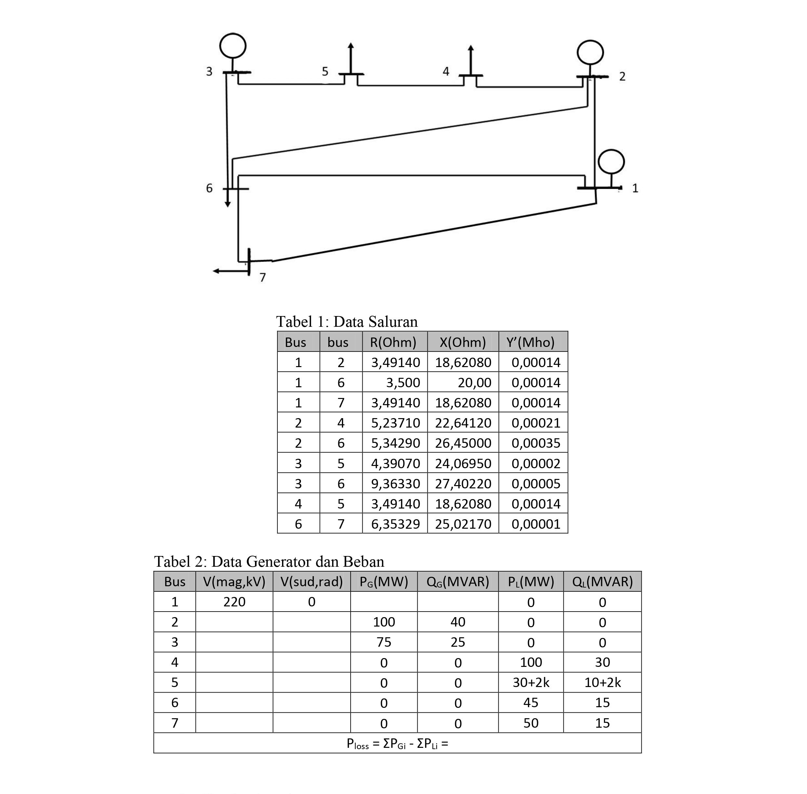

# Python-OSSDE

***Electric Power System Stability and Operation***

In the project given by my lecture, I have done calculate using **Matlab** before. I want to try **Python** to perform the calculation. Electrical Network Data are given below.

>

# To do
1. Bus 1 as slack bus with V1 = 220 kV. Calculate bus voltage and power that unknown. Then calculate real power loss. Write the result on the table 2.

# Solution

1. The code on [numberone.py](./numberone.py)

>First, I need to find Voltage with Gauss Seidel Method
>>`Vbus: [[220.         +0.j] [222.59221802 -1.47934401j] [220.99923823 -2.58790192j] [217.31141086-10.41324995j] [216.4663692  -9.66877979j] [220.75227036 -3.11118912j] [219.42440185 -3.642961j]]`

>Find Magintude
>>`V (Magnitude, kV)[[220.        ]
 [222.59221802]
 [220.99923823]
 [217.31141086]
 [216.4663692 ]
 [220.75227036]
 [219.42440185]]`

>Find Angle
>>`V (Angle, rad)
 [[ 0.        ]
 [-0.00664588]
 [-0.01170947]
 [-0.04788193]
 [-0.04463676]
 [-0.01409264]
 [-0.01660083]]`

>Calculate Sbus using new Vbus
>>`Sbus :
 [[  85.9488007-68.1467101j]
 [ 100.       +40.j       ]
 [  75.       +25.j       ]
 [-100.       -30.j       ]
 [ -64.       -44.j       ]
 [ -45.       -15.j       ]
 [ -50.       -15.j       ]]`

>Calculate Sloss
>>`Sloss : [[1.9488007-107.1467101j]]`

>Find Ploss
>>`Ploss : [[1.9488007]]`

>The Table
>>Bus | V (mag, kV) | V (Angle, rad) | Pgen (MW)  | Qgen (MVar) | PLoad (MW) | QLoad (MVar) |
>>:-:|-------------:| --------------:| ----------:| -----------:| ----------:| ------------:|
>>1 | 220           | 0              | **85.9488007** | **-68.1467101** | 0          | 0            |
>>2 | **222.59221802**  | **-0.00664588**    | 100        | 40          | 0          | 0            |
>>3 | **220.99923823**  | **-0.01170947**    | 75         | 25          | 0          | 0            |
>>4 | **217.31141086**  | **-0.04788193**    | 0          | 0           | 100        | 30           |
>>5 | **216.4663692**   | **-0.04463676**    | 0          | 0           | **64**     | **44**       |
>>6 | **220.75227036**  | **-0.01409264**    | 0          | 0           | 45         | 15           |
>>7 | **219.42440185**  | **-0.01660083**    | 0          | 0           | 50         | 15           |
>>---
>>Ploss = **1.9488007 MW**